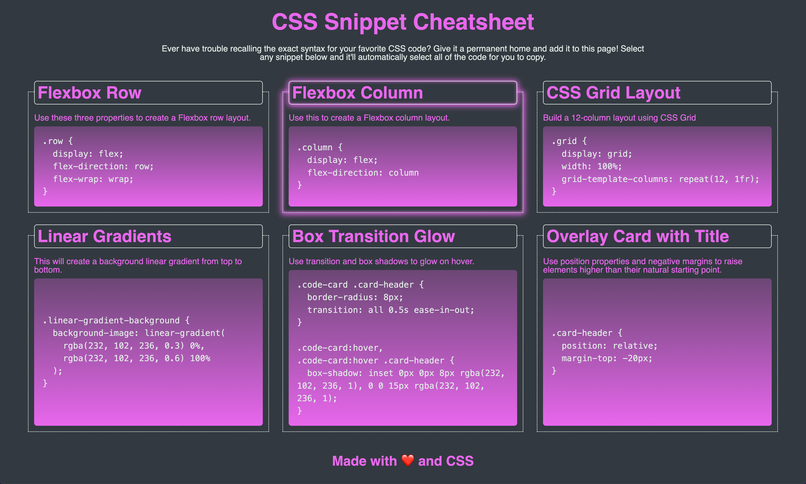

# mini-project: My New Website Clone

## Description

This was the second mini project on the course I was taking. We needed to create six cards which each gave us information on `CSS` techniques and code examples.

You can see the deployed page here: https://prodigalprogrammer.github.io/mini-project-two/

## Usage

The page starts with three columns and two rows, but you can resize the site and the columns and rows will adjust accordingly.

## Features

- Hover over the cards and they will glow. The `transition` property makes it look even better!
- Clicking onto the code will automatically select the whole code block. This was achieved using the `user-select` property.
- A gradient was used over the background to create a nice effect.
- The demo version of this webpage was created using `display: flex` but I found a way to recreate it using `display: grid` which I think I prefer &#9786;
